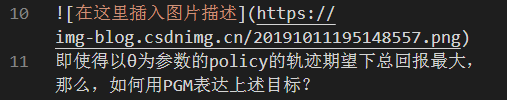
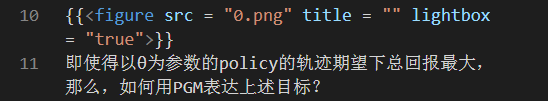

# blog_transformer
Tool for markdown blog migrate

# Description
This tool do the things below:

1. Input a markdown file, download all pictures from "\!\[\]\(https://xxx.xxx\)", saved as {%d}.xxx
2. Modify the "\!\[\]\(https://xxx.xxx\)" to the request form(for example, \{\{\<figure src = "{0}" title = "" lightbox = "true">\}\} which is required by [Hugo](https://sourcethemes.com/academic/docs/writing-markdown-latex/#images))

For example:

Input markdown:





Output markdown:





In the same time, 0.png is downloaded into the path where Input markdown file exist.

# Usage
```bash
python3 blog_transformer.py -f YorMarkdown.md
```
